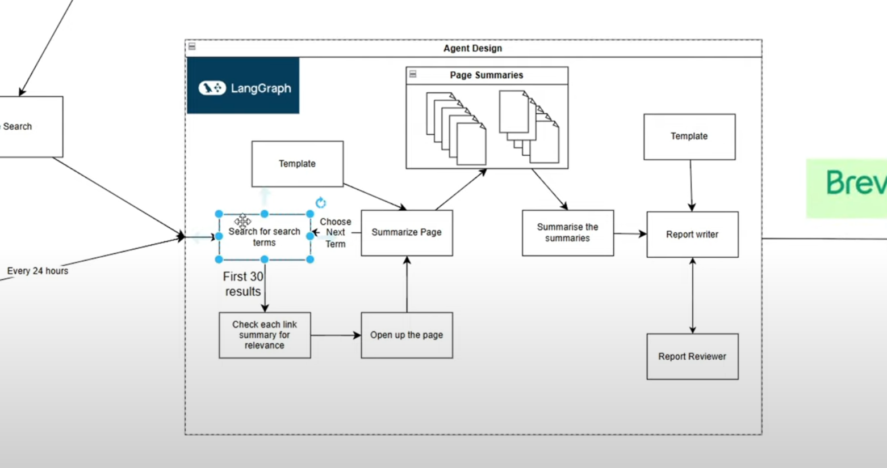
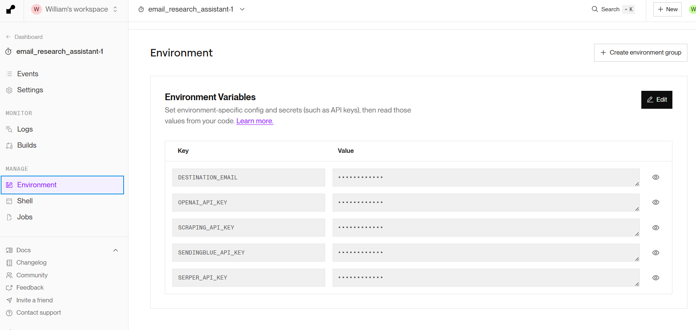

# Google Search Email Research Assistant made with LangChain / LangGraph - Deployed to Render

Deploy an email research assistant to send you a daily summary of the latest AI research (or whatever you want).

Required API keys:
- Serper API key (for Google search https://serper.dev/)
- Scraping API key (for scraping urls & rendering JS https://scrapingfish.com/)
- Sendinblue API key (for sending emails https://app.brevo.com/)
- OpenAI API key (for summarizing the results https://platform.openai.com)

## Setup for Render deployment

1. Point a render CRON job to this repository
2. Set the environment variables in the render dashboard as per the image below:

3. Set the entry point to `python email_script.py`

Thats it!

## Setup for local development

1. Install the required packages `pip install -r requirements.txt`
2. Set the environment variables in the .env file
3. Run the script with `python email_script.py`

